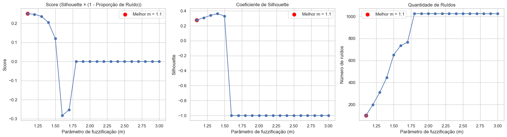

## Resumo
Este projeto implementa o algoritmo de agrupamento Fuzzy C-Means e o aplica sobre uma base de dados de Pokémon. Os agrupamentos são avaliados por meio do coeficiente de Silhouette e analisados visualmente utilizando Análise de Componentes Principais (PCA).

O projeto coloca em prática os conhecimentos adquiridos no 5º semestre do curso de Ciência de Dados e Inteligência Artificial, ele integra conhecimentos das disciplinas:
- Métodos e Análise Multiariada;
- Aprendizado não Supervisionado;
- Arquitetura de Grande Volume de Dados.

## Tecnologias utilizadas:
- Python;
- Pandas e NumPy para manipulação dos dados;
- PySpark para processamento da base;
- Scikit-learn (MinMaxScaler, PCA e Silhouette Score);
- Matplotlib e Seaborn para visualização.

## Como executar
1. Clone o repositório;
2. Instale as dependências;
3. Execute célula por célula o main.ipynb.

## Funcionalidades
- Tratamento da base de dados bruta (Remoção de duplicatas, renomeando campos);
- Aplicação do algoritmo de agrupamento Fuzzy C-Means implementado manualmente, com variação do parâmetro 'm', e score ponderado com ruídos e coeficiente de Silhouette;
- Análise dos elementos de cada cluster formado;
- Escolha dos componentes principais necessários para visualização (gráficos 2d e 3d interativos).

## Resultados
A implementação manual do algoritmo Fuzzy C-Means foi a etapa mais desafiadora do projeto, exigindo a implementação do processo iterativo de atualização das pertinências e dos centroides. A variação do coeficiente de fuzzificação (m) permitiu observar como diferentes níveis de sobreposição entre os clusters influenciam a qualidade dos agrupamentos, avaliada pelo coeficiente de Silhouette e, principalmente, pelo score (Silhouette × (1 - Proporção de Ruído)). 
Conforme apresentado na **Figura 1**, o coeficiente de Silhouette apresenta um dos maiores valores. Entretanto, à medida que o valor de *m* aumenta, observa-se também um crescimento significativo na quantidade de elementos classificados como ruído. Para equilibrar esses dois aspectos, foi utilizado o score, determinando o melhor m como 1.1:

  

  Figura 1 – Avaliação visual do parâmetro de fuzzificação (m)

Com o parâmetro definido, o algoritmo foi executado para gerar os agrupamentos finais. Conforme ilustrado na **Figura 2**, a projeção dos dados utilizando PCA possibilitou analisar visualmente a separação entre os clusters obtidos.

  

  Figura 2 – Visualização tridimensional dos clusters obtidos pelo algoritmo Fuzzy C-Means após redução de dimensionalidade por PCA.

## Equipe
- Edson Eduardo Ferreira - 23908965
- Eduarda Pains Campos - 23882004
- Gabriel Batista Chiezo - 23028678
- Tayana Araujo de Assis - 23880883
- Yan Yoshida Luz - 23911118
